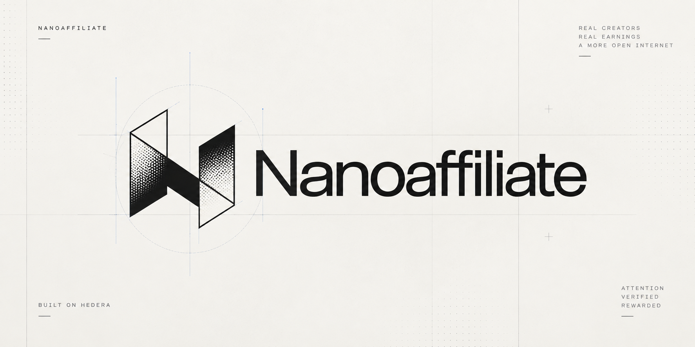
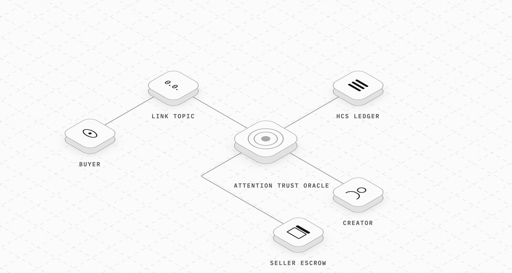
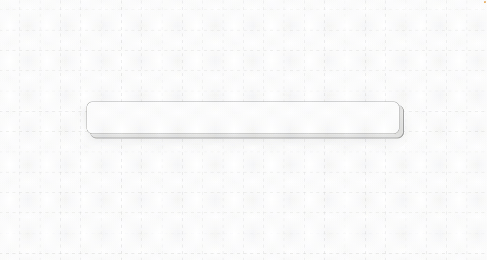
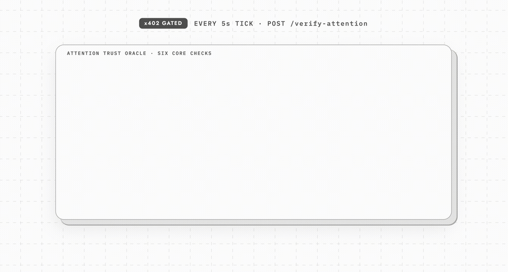
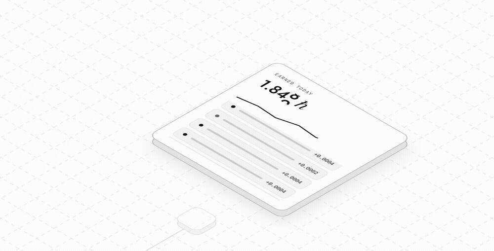

<div align="center">



# NanoAffiliate

**Attention, metered by the second, priced by a paid trust oracle, settled instantly on Hedera — publicly auditable by anyone.**

No ad network in the middle. No monthly payout minimums. Every five seconds of genuine human attention on a creator's link is scored, paid, and written to a public ledger in real time.

</div>

---

## 🔗 Live on Hedera Testnet

This isn't a simulation — every id below is a real, currently-active Hedera testnet entity this app talks to.

| Entity | Value | Explorer |
|---|---|---|
| **HCS Identity Registry Topic** | `0.0.10481492` | [HashScan ↗](https://hashscan.io/testnet/topic/0.0.10481492) |
| **Attention Trust Oracle — UAID** | `uaid:aid:6ZC9S6Nj2DGvrfiM9Ur7fHCHG5qLaG6ADgQb1uEXWfsqTqpMBVpdyHhRXJKpLxHhGZ;registry=hol;proto=hcs-10;nativeId=hedera:testnet:0.0.10475884` | [Account `0.0.10475884` ↗](https://hashscan.io/testnet/account/0.0.10475884) |
| **Agent — UAID** | `uaid:aid:9PuKqrM6K3UshZ4ochKBfRpkj4XUFvSXCMGC9Khu6qDhCn9pkzWjL5HEYQHHpu7TwR;registry=hol;proto=hcs-10;nativeId=hedera:testnet:0.0.10458787` | [Account `0.0.10458787` ↗](https://hashscan.io/testnet/account/0.0.10458787) |

Both UAIDs are HCS-14 deterministic identifiers, published as HCS-11 profiles to the identity-registry topic above. The **Oracle** is the paid trust-scoring service (gets a real x402 micropayment on every scoring call); the **Agent** is the sole signer that submits every real transaction on the platform's behalf — HCS messages, escrow transfers, topic creation — under a single `AsyncMutex` so nothing races.

Every link a creator mints gets **its own HCS topic** — not a shared feed — and every tick, payout, click, and conversion on that link is a real message written to it. Nothing in the ledger view of this product is mocked.

---

## What this actually is

A creator picks a product, mints a link. That link *is* a Hedera topic. A reader clicks it and lands on a page that scores their genuine attention every 5 seconds — tab focus, scroll/mouse naturalness, device fingerprint, session diversity — using a **paid trust oracle** gated by the [x402](https://x402.org) payment protocol (the Agent pays the Oracle a real micropayment *before* every scoring call goes through). A passing tick pays the creator instantly from the seller's on-chain escrow. A borderline reader can pass a real **World ID Selfie Check** — a biometric liveness check, no Orb required — to unlock the full rate. Everything is written to that link's own HCS topic as it happens.

<p align="center"></p>

---

## How a link becomes a topic

Minting a link isn't a database write with a marketing label — it's a real `TopicCreateTransaction`, followed by a `link_created` manifest submitted as that topic's first message. The returned topic ID *is* the shareable URL.

<p align="center"></p>

```
nanoaffiliate.io/t/{hcs_topic_id}
```

Click it, and the Link Redirect Service looks the topic up, opens a session, submits a `click` message to that same topic, and serves the attention page — styled to match the rest of the app, not a bare redirect stub.

---

## The Attention Trust Oracle

Every 5 seconds the attention page is open and visible, it posts real behavioral signals to `/report-signals`. That request can't reach the scoring logic until the Agent pays the Oracle a genuine Hedera micropayment via x402's challenge → pay → unlock flow — spamming fake ticks costs real money before you even get to the scoring itself.

<p align="center"></p>

The score is a weighted sum — tab focus, interaction recency, scroll/mouse-movement naturalness, device fingerprint, plugin count, and **session diversity** (how many genuinely distinct IP/fingerprint pairs have hit *this link* recently, tracked in Redis — a coordinated bot farm on a narrow IP range scores low here even if each bot's own behavior looks clean). One hard gate sits in front of all of it: `navigator.webdriver === true` is an instant reject, no other signal buys it back.

| Score | Outcome |
|---|---|
| ≥ 0.75 | Paid in full |
| 0.40 – 0.75 | Paid at half rate, and counts toward a borderline streak |
| 6 consecutive borderline ticks | **World ID Selfie Check required** to keep earning |
| < 0.40 | Rejected, no payout |

A passed Selfie Check unlocks `rate_verified_per_tick` — the premium rate — for the rest of that session, and resets the borderline streak so the session isn't stuck re-triggering the check forever.

---

## Real-time, on-chain payouts

No payout minimums, no monthly cycle. Every paid tick is an instant `TransferTransaction` from the seller's escrow straight to the creator's Hedera account, in HBAR or USDC, the moment the Oracle clears it.

<p align="center"></p>

Sellers fund a real escrow account per onboarding (or connect a wallet and send HBAR to it directly, no backend key involved), and can optionally cap how much of that escrow one specific product is allowed to draw — a per-product spending budget layered on top of the account-wide balance.

---

## Everything else this ships with

- **HashPack / WalletConnect** — real wallet connection ([`@hashgraph/hedera-wallet-connect`](https://github.com/hashgraph/hedera-wallet-connect)) for onboarding creators and sellers, and for sellers to fund their own escrow with a real signed transfer from their own wallet — no backend key ever touches seller funds.
- **World ID Selfie Check login** — creator authentication is a real biometric proof, not a password. The proof's nullifier is looked up against a real creator record, so the same verified human always lands on the same account from any browser or device.
- **Per-product escrow budgets** — a seller-set spend cap, independent of the account's total balance, enforced on every payout path (ticks, self-reported conversions, and scheduled webhook-verified bonuses — with a real refund path if a scheduled bonus gets cancelled before it fires).
- **Full creator dashboard** — Products, Links, Payouts, Settings, and a live Analytics view (polls every 12s) built entirely off real listing endpoints, no mock data.
- **Two independently-audited payment rails per tick** — the x402 micropayment to the Oracle, and the plain `TransferTransaction` payout to the creator — kept conceptually and financially separate, exactly as the architecture specifies.

---

## Tech stack

| | |
|---|---|
| **Backend** | Node.js · Express · TypeScript · `@hiero-ledger/sdk` · `@x402/core` + `@x402/hedera` · `@worldcoin/idkit-core` · Supabase (Postgres) · Redis + BullMQ · Zod |
| **Frontend** | Next.js 16 (App Router) · React 19 · Tailwind CSS v4 · Motion (Framer Motion) · `@hashgraph/hedera-wallet-connect` · `@worldcoin/idkit-core` |
| **Chain** | Hedera testnet — native HCS topics, native `TransferTransaction`s, no smart contracts |

---

## Project structure

```
NanoAffiliate/
├── backend/                  Express API — Oracle, Agent, tick scheduler, redirect service
│   ├── src/
│   │   ├── hedera/           Hedera client, HCS helpers, payments, Mirror Node reads
│   │   ├── x402/             Oracle x402 resource server + Agent x402 client
│   │   ├── identity/         HCS-14 UAID generation, HCS-11 profile publishing
│   │   ├── scoring/          Pure attention-scoring function (no I/O)
│   │   ├── services/         Oracle scoring pipeline, per-tick orchestration
│   │   ├── queue/             BullMQ tick queue, bonus-release queue, cron scheduler
│   │   ├── routes/           sellers · creators · links · oracle · world (ID) · dashboard · webhooks …
│   │   ├── db/                Typed Supabase access layer
│   │   └── web/               The reader-facing attention page (server-rendered)
│   └── supabase/migrations/   SQL schema, applied in order
├── frontend/                  Next.js creator dashboard + marketing site
│   └── app/
│       ├── login/              World ID Selfie Check → creator auth
│       ├── selfie/             Standalone World ID test harness
│       ├── products/ links/ payouts/ analytics/ settings/
│       └── api/world/          Server-only World ID RP-signing (for the standalone test page)
└── docs/assets/                README media
```

---

## Getting started

### 1. Backend

```bash
cd backend
npm install
cp .env.example .env   # fill in real Hedera + Supabase + World ID credentials
npm run bootstrap:identity   # generates + publishes the Oracle/Agent UAIDs once
npm run dev
```

Required env vars: `ORACLE_HEDERA_ACCOUNT_ID` / `ORACLE_HEDERA_PRIVATE_KEY`, `AGENT_HEDERA_ACCOUNT_ID` / `AGENT_HEDERA_PRIVATE_KEY`, `SUPABASE_URL` / `SUPABASE_SERVICE_KEY`, `REDIS_URL`, `WORLD_ID_APP_ID` / `WORLD_ID_RP_ID` / `WORLD_ID_SIGNER_KEY` (get these from the [World Developer Portal](https://developer.world.org)), `HCS_TOPIC_IDENTITY_REGISTRY`, `BASE_URL`.

Run every SQL file in `backend/supabase/migrations/` against your Supabase project, in order, before starting the server.

### 2. Frontend

```bash
cd frontend
npm install
cp .env.example .env.local   # point NEXT_PUBLIC_API_BASE_URL at your backend
npm run dev
```

`NEXT_PUBLIC_WALLETCONNECT_PROJECT_ID` (free, from [cloud.walletconnect.com](https://cloud.walletconnect.com)) enables the HashPack "Connect wallet" button — everything else degrades to manual entry without it.

---

## Deployment

The live instance runs on **Railway** (backend + Redis) and **Vercel** (frontend) — not a hypothetical setup, this is what's actually serving `nanoaffliate-production.up.railway.app` right now.

- **Backend** — a Railway service built from `backend/` via Nixpacks, running `npm run build && npm start`. All the real env vars (Hedera, Supabase, Redis, World ID) are set in Railway's dashboard, not committed anywhere.
- **Redis** — a separate Railway Redis service, wired to the backend with `REDIS_URL=redis://default:<password>@redis.railway.internal:6379`. That `.railway.internal` hostname is Railway's **private network** — it only resolves *inside* Railway, which means local dev can never reach the production Redis directly (BullMQ's tick queue and the diversity-score aggregate both depend on it). Point `REDIS_URL` at a local or separately-hosted Redis for local development instead.
- **Node version** — pinned to `>=22` (`package.json` `engines`, plus a `.node-version` file). `@supabase/supabase-js` v2 constructs a `RealtimeClient` that requires native `WebSocket` unconditionally, even though this app never uses Realtime — on Node 20 that's an immediate crash at `createClient()`. Nixpacks reads the pin and picks Node 22+ automatically.
- **Frontend** — deployed on Vercel from `frontend/`, with `NEXT_PUBLIC_API_BASE_URL` pointed at the Railway backend's public URL. Since `NEXT_PUBLIC_*` vars are baked in at build time, changing that value requires a fresh deploy to take effect, not just a saved env var.
- **Redeploys aren't automatic across the two services** — pushing backend changes doesn't touch the frontend's build and vice versa; a change to one only ships once that service's own deploy runs.

---

## API surface

| Route | What it does |
|---|---|
| `POST /sellers` · `POST /sellers/:id/products` | Onboard a seller (mints a real escrow account) and list a product |
| `POST /creators` · `POST /links` | Register a creator, mint a link (real HCS topic) |
| `GET /t/:topicId` | The redirect service — creates a session, serves the attention page |
| `POST /report-signals` → `POST /verify-attention` | Client tick signals → x402-gated Oracle scoring |
| `POST /world/rp-signature` · `POST /world/verify` | Reader-side Selfie Check escalation |
| `POST /world/login-signature` · `POST /world/login-verify` | Creator login via Selfie Check |
| `POST /conversions/self-report` · `POST /webhooks/purchase-confirmed` | The two purchase-confirmation paths (instant vs. scheduled + fraud-window) |
| `GET /sellers` `/products` `/links` `/payouts` `/creators` | Real listing endpoints backing the dashboard — no mock data anywhere |

---

<div align="center">


Built on [Hedera](https://hedera.com) · Trust priced by [x402](https://x402.org) · Identity via [World ID](https://world.org)

</div>
